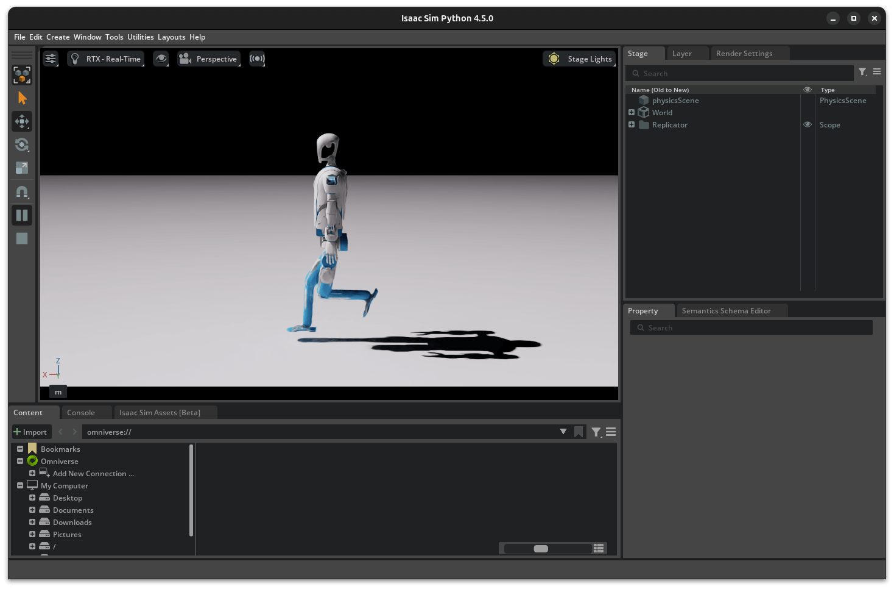
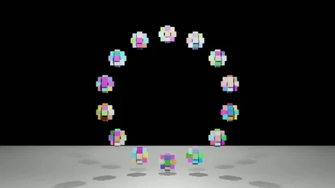
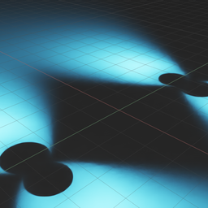
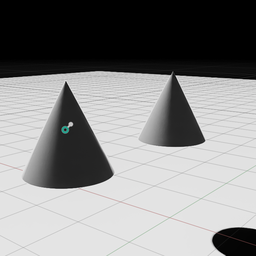
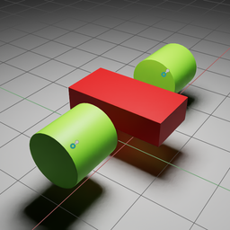

# IsaacSim 4.5.0使用用例

从IsaacSim官网下载isaac-sim-standalone@4.5.0 binary或者用pip安装，找到IsaacSim安装位置，记为`$ISAAC_PATH`，例如`~/Programs/isaac-sim-standalone@4.5.0`，将本仓库直接clone在该路径下：
```bash
cd $ISAAC_PATH
git clone https://github.com/wty-yy/isaac-sim-use-cases.git
git submodule update --init --depth 1
```

下面会提供两种Python脚本交互方法，分别为Standalone和Interactive，一个直接可以通过Python启动仿真，另一个可以在已经启动的UI界面中直接加载当前的脚本

## VsCode代码提示
需要使用`$ISAAC_PATH/.vscode/setting.json`来为VsCode加入包路径，因此，我们直接在`$ISAAC_PATH`下打开VsCode即可：
```bash
cd $ISAAC_PATH
code .
```
**Trick**：如果把`setting.json`中的全部包路径都加入索引，可能导致包索引很慢，因此我们可以仅保留代码中所需要的部分路径，将其他的都注释掉，可大幅提高索引速度

## Standalone

本启动方法可单独通过Python启动仿真，缺点是每次启动新仿真时需消耗一点时间，可用于RL训练

代码使用方法：
1. 直接通过`python.sh <代码路径>`执行
2. **推荐**使用conda环境启动，参考[advanced-running-with-anaconda](https://docs.isaacsim.omniverse.nvidia.com/latest/installation/install_python.html#advanced-running-with-anaconda)安装好`isaac-sim`环境，进入环境后直接执行`python <代码路径>`

| Code | Info | Thumbs |
| - | - | - |
| [kuavo_gait.py](./standalone/kuavo_gait.py) | 固定Kuavo42机器人对腿部轨迹进行调试 |  |

## Interactive
本启动方法基于已经启动的一个UI界面，并通过该界面启动最新的脚本，可用于代码调试、机器人仿真测试

使用`isaacsim.examples.interactive`插件进行编码，无需每次重启IsaacSim UI，点击LOAD按钮即可加载最新代码(hot-reload)，[使用方法](./interactive/README.md)

| File | Info |
| - | - |
| [hello_world.py](./interactive/my_hello_world/hello_world.py) | 添加Cube，参考[Hello World](https://docs.isaacsim.omniverse.nvidia.com/latest/core_api_tutorials/tutorial_core_hello_world.html) |
| [hello_jetbot.py](./interactive/my_hello_world/hello_jetbot.py) | 添加Jetbot及Controller，参考[Hello Robot](https://docs.isaacsim.omniverse.nvidia.com/latest/core_api_tutorials/tutorial_core_hello_robot.html) |
| [franka_pick_and_place.py](./interactive/my_hello_world/franka_pick_and_place.py) | 添加Franka及PickPlaceController，参考[Adding a Manipulator Robot](https://docs.isaacsim.omniverse.nvidia.com/latest/core_api_tutorials/tutorial_core_adding_manipulator.html) |
| [pxr_demos/pxr_demo.py](./interactive/my_hello_world/pxr_demos/pxr_demo.py) | 使用pxr库添加Light, Plane, Cube |
| [cube_split/cube_split.py](./interactive/my_hello_world/cube_split/cube_split.py) | 使用camera记录生成的环形cube飞散的效果  |

## USD Demos
| File | Info | Thumbs |
| - | - | - |
| [environment_setup.usd](./usd_demos/environment_setup.usd) | [官方教程Environment Setup](https://docs.isaacsim.omniverse.nvidia.com/latest/gui/tutorial_intro_environment_setup.html) |  |
| [revolute_joint.usd](./usd_demos/revolute_joint.usd) | 测试RevoluteJoint相对参考系 |  |
| [mock_robot.usd](./usd_demos/mock_robot.usd) | [官方教程Assemble a Simple Robot](https://docs.isaacsim.omniverse.nvidia.com/latest/gui/tutorial_gui_simple_robot.html) |  |
